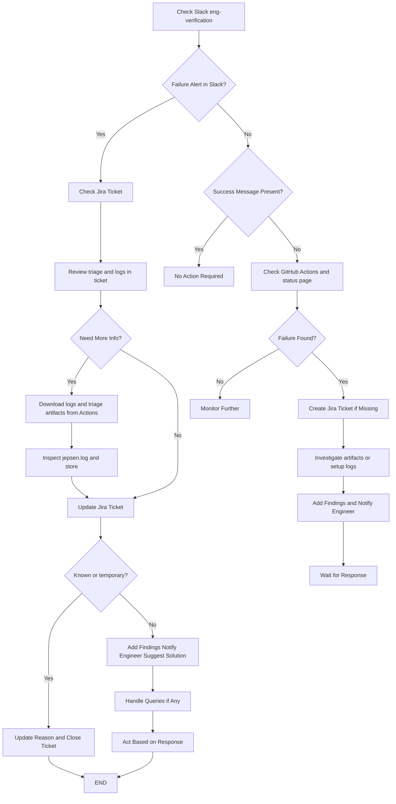

# Daily Test Monitoring & Failure Handling SOP

This document is a quick daily procedure for monitoring Scalar Jepsen tests and handling failures.

Kelpie verification and benchmarks are documented in [kelpie-test](https://github.com/scalar-labs/kelpie-test/blob/master/docs/daily-test-checks.md). Test environment details for this repo are in [test-environment-and-setup.md](./test-environment-and-setup.md).

**This repo owns:** Jepsen ScalarDB, ScalarDL, and ScalarDB Cluster dailies. **kelpie-test** owns Kelpie verification and benchmarks.

---

## 1. Daily Monitoring

* Check Slack (`eng-verification`) for daily Jepsen results (webhook; channel is configured on the webhook secret).

  * Daily ScalarDB Cluster, ScalarDL, and ScalarDB test summaries are posted after each scheduled run.
  * Failed or timed-out tests include a first-pass triage label in the Slack line when triage succeeded (for example `TEMPORARY_ISSUE`).

* If there is no failure message, or no success message:

  * Check GitHub Actions: https://github.com/scalar-labs/scalar-jepsen/actions
  * Check the status page: https://scalar-labs.github.io/scalar-jepsen/ (gh-pages, 30-day history) after the **Update status page** workflow finishes.

* Confirm the expected scheduled runs completed (UTC):

  | Workflow | Cron | Approx IST |
  |----------|------|------------|
  | Daily ScalarDB Cluster test | `0 10 * * *` | 15:30 |
  | Daily ScalarDL test | `0 15 * * *` | 20:30 |
  | Daily ScalarDB test | `0 20 * * *` | 01:30 next day |

Environments are ephemeral GitHub-hosted runners. There is no Azure VM to retain or destroy.

---

## 2. Failure Handling (Slack Alert Present)

If a failure alert is present in Slack:

* Open the Jira ticket (project `DLT`). The ticket description includes the workflow run URL, commit, and the triage summary when available. The environment field points at artifacts `logs-<test>` and `triage-<test>`.

* Review the first-pass triage (ticket, Slack suffix, job step summary, or the `triage-<test>` artifact). Treat it as a hint only — see [AI triage](#ai-triage).

* If more information is needed:

  * Open the Actions run from Slack or Jira.
  * Download `logs-<test>` (Jepsen `store`, including `current/jepsen.log`) and `triage-<test>` if present.
  * Confirm the result in `result-<test>` (`success` / `failure` / `timeout`).

* Update the Jira ticket:

  * **Known / temporary issue** (infrastructure, timeout, missing log, known flaky env)

    * Record the reason.
    * Close the ticket. The test environment is already gone (`docker compose` / Kind on the runner).

  * **New issue / real inconsistency**

    * Add findings from `jepsen.log` and related store files.
    * Notify the relevant engineer(s).
    * Include a potential solution if available, and request confirmation before acting on it.

* Wait for a response and follow up on the ticket.

---

## 3. Failure Handling (No Slack Alert / No Ticket)

If a failure occurred and:

* No Slack alert is present
* No Jira ticket was created
* OR no success message exists (for example the job failed before the test step)

Then:

* Check the Actions run (job logs for compose/Kind/build failures).
* Create a Jira ticket in `DLT` with the run URL and findings.
* Download artifacts if they exist; otherwise investigate the failed setup step.
* Notify the relevant engineer(s) and wait for a response.

Jira and Slack helpers use `continue-on-error`, so a green notify job does not prove the test passed. Always confirm the matrix jobs and `result-*` artifacts.

---

## 4. AI triage

Daily workflows run [`.github/scripts/triage.py`](../.github/scripts/triage.py) on failure. It reads the tail of `jepsen.log` and classifies the failure.

**Labels**

| Label | Meaning |
|-------|---------|
| `TEMPORARY_ISSUE` | Likely transient, environmental, or infrastructure-related |
| `INCONSISTENCY_REQUIRES_INVESTIGATION` | Credible evidence of a consistency/correctness violation |
| `UNKNOWN_REQUIRES_HUMAN` | Insufficient or conflicting evidence |
| `NO_JEPSEN_LOG` | No `jepsen.log` (failure before Jepsen wrote a log) |

The script also tags the final log line as `ANALYSIS_INVALID`, `ANALYSIS_ERRORS_NO_ANOMALIES`, or `OTHER_FAILURE` before calling the model. `"Analysis invalid!"` alone is not treated as a real consistency bug.

**Operator rules**

* Always confirm the label against `jepsen.log` and the store. Do not close a ticket as temporary, or escalate as an inconsistency, based only on the model.
* If triage is missing, empty, or failed (`continue-on-error: true` on the triage step), investigate the logs as usual.

**Future update required**

Triage currently calls GitHub Models (`https://models.github.ai/inference/chat/completions`) with `openai/gpt-4o-mini`. That model is no longer available and will need to be replaced. Until then, missing or wrong triage is expected; investigation must not wait on a successful AI pass.

---

## 5. Workflow Diagram

---

## 6. Additional details

* How environments are created and how to reproduce a failed cell: [test-environment-and-setup.md](./test-environment-and-setup.md)
* Kelpie daily verification and benchmarks: [kelpie-test daily SOP](https://github.com/scalar-labs/kelpie-test/blob/master/docs/daily-test-checks.md)
